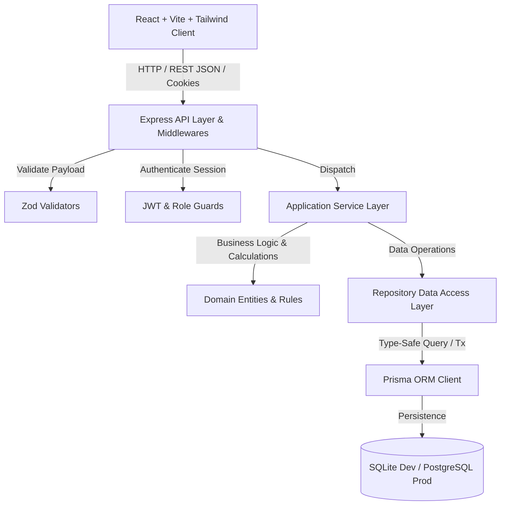
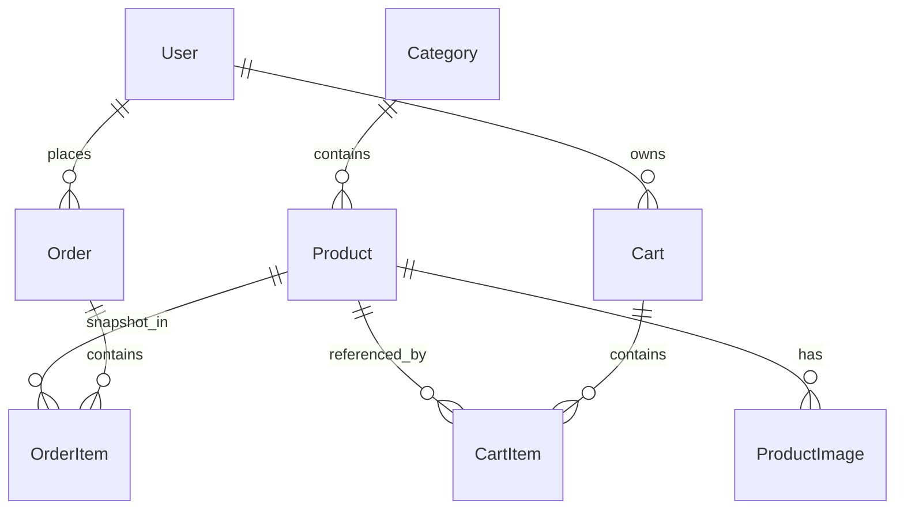

# 🛍️ Nexus Commerce — Production E-Commerce Platform

> A modern, scalable, secure, and fully responsive full-stack E-Commerce platform engineered with **React 19**, **Node.js 24**, **TypeScript**, **Prisma ORM**, and **Tailwind CSS**.

[](https://www.typescriptlang.org/)
[](https://react.dev/)
[](https://nodejs.org/)
[](https://www.prisma.io/)
[](https://tailwindcss.com/)
[](https://vitest.dev/)

---

## 🌟 Executive Overview

Nexus Commerce is built from the ground up as a production-oriented e-commerce system that adheres to strict software engineering principles:
* **Server-Authoritative Business Logic**: Totals, taxes, shipping tiers, stock decrements, and role guards are calculated and strictly enforced by the backend. Client prices are treated purely as presentation data.
* **Atomic Concurrency Control**: Order checkouts execute within database transactions (`$transaction`), safely locking stock and eliminating race conditions.
* **Historical Data Integrity**: Order items store immutable price and product name snapshots so historical invoices remain constant when catalog prices fluctuate.
* **4-Layer Modular Architecture**: Presentation / API Layer $\rightarrow$ Application / Service Layer $\rightarrow$ Domain Layer $\rightarrow$ Infrastructure / Persistence Layer.
* **End-to-End Type Safety**: Shared Zod schemas and TypeScript interfaces across backend controllers, database models, and frontend UI components.

---

## 🏗️ Architecture & System Design



### Monorepo Structure

```
d:/E-Commerce Project/
├── server/                      # Node.js + Express + Prisma backend
│   ├── src/
│   │   ├── config/              # Env validation (Zod) & Prisma client
│   │   ├── controllers/         # HTTP request/response handlers
│   │   ├── middlewares/         # Auth (JWT cookies), role guards, error handlers
│   │   ├── repositories/        # Database access encapsulation
│   │   ├── routes/              # Express route declarations
│   │   ├── services/            # Pure business logic (Cart, Order, Auth, etc.)
│   │   ├── types/               # TypeScript interfaces & API envelopes
│   │   └── validators/          # Zod validation schemas
│   ├── tests/                   # Vitest unit & integration test suites
│   ├── prisma/                  # schema.prisma & seeders
│   └── package.json
│
├── client/                      # React 19 + Vite + Tailwind frontend
│   ├── src/
│   │   ├── components/
│   │   │   ├── ui/              # Button, Input, Modal, Badge, Card, Alert, Skeleton
│   │   │   ├── layout/          # Navbar, Footer, Layout, AdminSidebar
│   │   │   └── products/        # ProductCard, ProductGrid, ProductFilters
│   │   ├── pages/               # Customer & Admin routed pages
│   │   ├── services/            # Axios instance with credentials
│   │   ├── store/               # Zustand stores (AuthStore, CartStore)
│   │   └── types/               # Frontend TypeScript domain types
│   └── package.json
│
├── package.json                 # Unified root workspace scripts
└── README.md
```

---

## 🗄️ Relational Database Schema



### Core Entities & Constraints
* **`User`**: UUID PK, unique email, bcrypt `passwordHash`, role (`CUSTOMER` | `ADMIN`), timestamps.
* **`Category`**: UUID PK, unique name, unique URL slug, timestamps.
* **`Product`**: UUID PK, name, unique URL slug, price, stock level, active flag, category FK (`onDelete: Restrict`).
* **`ProductImage`**: URL, primary flag, display ordering, cascading FK to Product.
* **`Cart` & `CartItem`**: User 1-to-1 cart, composite unique constraint `[cartId, productId]` preventing duplicate item rows.
* **`Order` & `OrderItem`**: Financial breakdown (subtotal, tax, shipping, totalAmount), JSON shipping address snapshot, status enum (`PENDING`, `PROCESSING`, `SHIPPED`, `DELIVERED`, `CANCELLED`), and historical snapshots (`productNameSnapshot`, `unitPriceSnapshot`).

---

## 🚀 Getting Started Locally

### Prerequisites
* **Node.js v18+** (v24 recommended)
* **npm v9+**

### 1. Installation

Clone or open the workspace and install all dependencies:
```bash
# In server directory
cd server
npm install

# In client directory
cd ../client
npm install
```

### 2. Database Migration & Seeding

```bash
cd server
npx prisma db push
npx tsx prisma/seed.ts
```

*This automatically generates the database schema and populates sample electronics categories, multi-image flagship products, customer orders, and default users.*

### 3. Run Development Servers

**Option A: Individual Terminals**
```bash
# Terminal 1: Backend API (Port 5000)
cd server
npm run dev

# Terminal 2: Frontend Client (Port 5173 with proxy)
cd client
npm run dev
```

**Option B: Root Scripts**
```bash
npm run dev:server
npm run dev:client
```

Open your browser at **`http://localhost:5173`**.

---

## 🔑 Default Demo Accounts

For immediate testing, quick-fill buttons are integrated into the login page:

| Role | Email | Password | Privileges |
| :--- | :--- | :--- | :--- |
| **Administrator** | `admin@store.com` | `AdminPass123!` | Full Admin Portal, CRUD products, stock modifiers, category manager, order lifecycle status changer, business analytics |
| **Customer** | `customer@store.com` | `CustomerPass123!` | Catalog discovery, multi-filter search, cart management, checkout wizard, order history & receipts |

---

## 📡 RESTful API Reference

### 🔐 Authentication (`/api/auth`)
* `POST /api/auth/register` — Register a customer account.
* `POST /api/auth/login` — Sign in and receive HTTP-only session cookie.
* `POST /api/auth/logout` — Invalidate session and clear auth cookie.
* `GET /api/auth/me` — Retrieve current authenticated profile.

### 📦 Products & Categories
* `GET /api/categories` — List all categories with product counts.
* `POST /api/categories` — `[Admin]` Create a new category.
* `PUT /api/categories/:id` — `[Admin]` Update category.
* `DELETE /api/categories/:id` — `[Admin]` Delete category (safely blocked if products exist).
* `GET /api/products` — Paginated product catalog (`search`, `categoryId`, `minPrice`, `maxPrice`, `sort`, `page`, `limit`).
* `GET /api/products/:idOrSlug` — Single product details with image gallery.
* `POST /api/products` — `[Admin]` Create product with images and stock.
* `PUT /api/products/:id` — `[Admin]` Update product pricing, stock, metadata.
* `DELETE /api/products/:id` — `[Admin]` Delete product.

### 🛒 Cart & Checkout
* `GET /api/cart` — Retrieve customer's active cart with dynamic stock warnings.
* `POST /api/cart/items` — Add item to cart (validates inventory limits).
* `PATCH /api/cart/items/:itemId` — Adjust item quantity.
* `DELETE /api/cart/items/:itemId` — Remove line item.
* `DELETE /api/cart` — Clear entire shopping cart.
* `POST /api/orders` — **Atomic Checkout**: Locks stock $\rightarrow$ creates order $\rightarrow$ snapshot item prices $\rightarrow$ wipes cart.

### 🧾 Orders & Admin
* `GET /api/orders` — Customer's historical orders.
* `GET /api/orders/:id` — Single order receipt and address snapshot.
* `GET /api/admin/orders` — `[Admin]` All store orders with status filtering.
* `PATCH /api/admin/orders/:id/status` — `[Admin]` Update status (`PENDING` $\rightarrow$ `PROCESSING` $\rightarrow$ `SHIPPED` $\rightarrow$ `DELIVERED` $\rightarrow$ `CANCELLED`). *Restores inventory automatically upon cancellation.*
* `GET /api/admin/stats` — `[Admin]` Revenue metrics, total orders, low-stock count, recent orders.
* `GET /api/admin/users` — `[Admin]` User account directory.

---

## 🧪 Testing Strategy

Run the automated test suite covering 30 integration test scenarios across all core modules:

```bash
cd server
npm test
```

### Verified Test Suites:
1. **Health Check & API Foundation**: 200 health telemetry, standardized JSON envelope structure, 404 handler.
2. **Authentication Flow**: Registration, duplicate rejection, password complexity, JWT cookie session, protected `/api/auth/me`.
3. **Product Catalog & Filtering**: Pagination boundaries, search substring matches, slug lookups, admin CRUD guards.
4. **Cart Logic**: Stock limits, line subtotal calculations, tax estimation, quantity updates, removals.
5. **Atomic Checkout & Inventory Engine**: Empty cart rejection, interactive transaction execution, inventory depletion, order item snapshots, status transitions, inventory restoration upon cancellation, and aggregate analytics.

---

## 🛡️ Security Best Practices

* **HTTP-Only Cookies**: JWT authentication tokens delivered via `httpOnly`, `sameSite` cookies to prevent XSS exfiltration.
* **Bcrypt Password Hashing**: Passwords salted and hashed with 10 rounds; plaintext passwords never stored or returned.
* **Zod Payload Validation**: Strict whitelist validation on all input bodies, preventing parameter pollution and injection attacks.
* **HTTP Security Headers**: Express secured with `helmet` and custom `CORS` policy.
* **RBAC (Role-Based Access Control)**: Double-layer route guards (`requireAuth` and `requireAdmin`) enforcing that customer tokens can never access administrative mutations.
